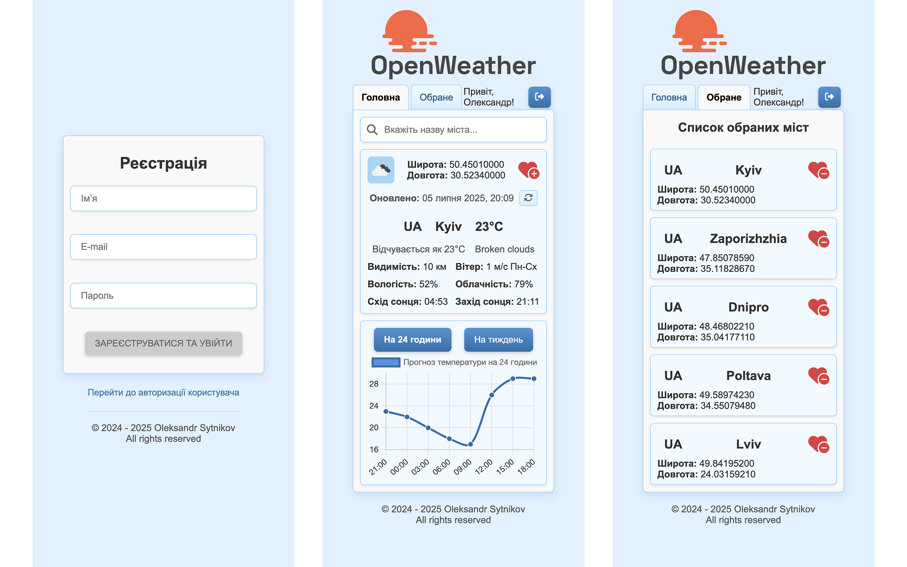
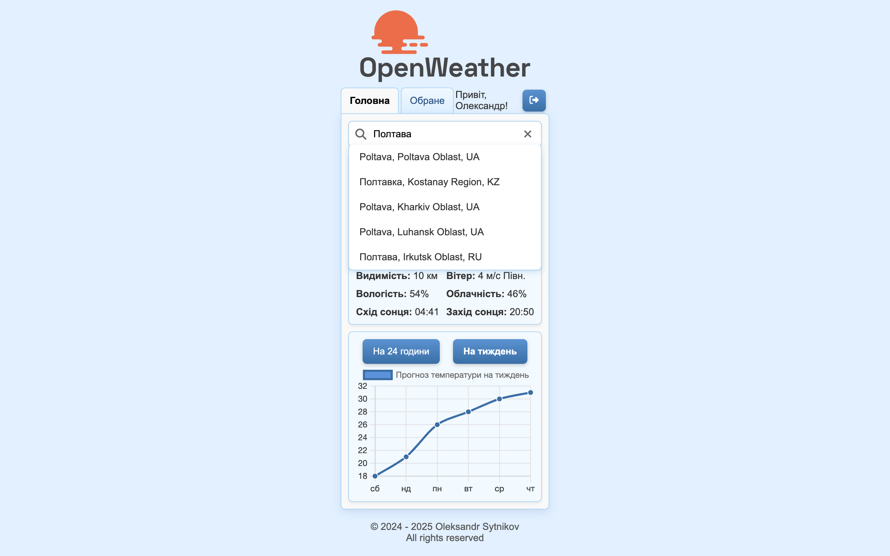
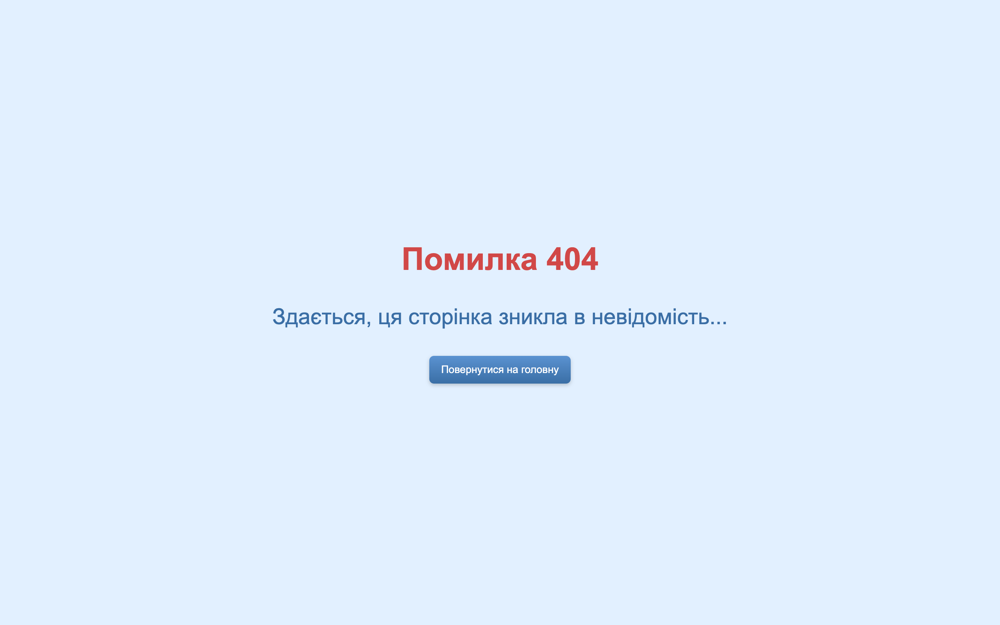

# Weather App

<p align="center">
  
</p>
<p align="center">
  
</p>

## Опис додатку

<strong>Weather App</strong> — інтерактивний застосунок для перегляду прогнозу погоди в різних містах із підтримкою геолокації та функцією створення списку обраних локацій.

<details>
  <summary><strong>Основна функціональність додатку</strong></summary>

- **Реєстрація та Авторизація**: Користувачі можуть зареєструватися в системі, надаючи свої дані (ім'я, email та пароль). Передбачено авторизацію за email і паролем. Всі маршрути, що потребують авторизації, є приватними.

- **Автокомпліт для Міст**: Додаток включає функціональність автокомпліта, яка дозволяє користувачам швидко знаходити потрібні міста для отримання прогнозу погоди.

- **Відображення Погоди**: Інформація про погоду відображається у вигляді картки, яка містить дані про погоду на поточний день. За замовчуванням відображається погода згідно геолокації користувача (визначається за IP адресою).

- **Графік Температури**: Додаток реалізує графік температури на 24 годити та на тиждень, використовуючи бібліотеки для візуалізації (Chart.js).

- **Вкладка "Обране"**: Користувачі можуть додавати та видаляти улюблені міста. Обрані міста зберігаються у базі даних, а максимальна кількість улюблених міст обмежена п'ятьма.

- **Адаптивний дизайн**: Додаток оптимізований для роботи на різних пристроях.

- **Прелоадери**: Використовуються прелоадери для зручного відображення процесу завантаження даних з API.

</details>

<details>
  <summary><strong>Скріншоти додатку</strong></summary>









</details>

## Використані технології та біблиотеки

<details>
  <summary><strong>Серверні технології</strong></summary>

- **Node.js** – середовище виконання JavaScript на сервері.
- **Express** – веб-фреймворк для створення серверних застосунків.
- **PostgreSQL** – реляційна база даних для зберігання структурованих даних.
- **Sequelize** – ORM для PostgreSQL. Працює з моделями, міграціями, сидуванням.
- **pg** / **pg-hstore** – залежності Sequelize для роботи з PostgreSQL.
- **date-fns** – бібліотека для форматування, обчислення та маніпуляції з датами.
- **bcrypt** – хешування паролів для зберігання в безпечному вигляді.
- **jsonwebtoken** – генерація і перевірка JWT токенів для автентифікації.
- **cookie-parser** – middleware для обробки HTTP cookie.
- **cors** – middleware для керування політикою доступу між доменами (CORS).
- **dotenv** – бібліотека для завантаження змінних оточення з `.env` файлу.
- **yup** – бібліотека для валідації даних на сервері.

</details>

<details>
  <summary><strong>Клієнтські технології</strong></summary>

- **React** – бібліотека для побудови інтерфейсів користувача.
- **React DOM** – бібліотека для взаємодії React з DOM.
- **React Router DOM** – бібліотека для роботи з маршрутизацією в React.
- **Redux Toolkit (@reduxjs/toolkit)** – інструменти для роботи з глобальним станом.
- **React Redux** – офіційна бібліотека для інтеграції Redux з React.
- **Redux Logger** – middleware для логування дій Redux у консолі.
- **Axios** – бібліотека для виконання HTTP-запитів.
- **Chart.js** – бібліотека для створення графіків і діаграм.
- **Date-fns** – бібліотека для роботи з датами, яка використовується для форматування і обробки часу.
- **Font Awesome** – набір іконок для інтерфейсу.
- **Framer Motion** – бібліотека для створення анімацій у React.
- **Formik** – бібліотека для керування формами в React, що спрощує обробку стану, валідації та подій у формах.
- **Yup** – бібліотека для валідації даних (часто використовується з Formik).

</details>

<details>
  <summary><strong>Загальні для клієнта та сервера Dev Dependencies</strong></summary>

- **ESLint** – інструмент для аналізу коду, що допомагає дотримуватися кращих практик програмування.
- **ESLint Config Prettier** – конфігурація ESLint для сумісності з Prettier.
- **ESLint Plugins**:
  - **eslint-plugin-import** – перевіряє правильність імпорту модулів.
  - **eslint-plugin-jsx-a11y** – допомагає покращити доступність JSX-коду.
  - **eslint-plugin-optimize-regex** – оптимізує регулярні вирази.
  - **eslint-plugin-prettier** – інтеграція Prettier з ESLint.
  - **eslint-plugin-promise** – забезпечує дотримання кращих практик при роботі з промісами.
  - **eslint-plugin-react** – лінтинг специфічного для React коду.
  - **eslint-plugin-react-hooks** – перевіряє коректне використання React-хуків.
  - **eslint-plugin-react-perf** – виявляє неефективні патерни у React-компонентах.
  - **eslint-plugin-react-refresh** – підтримка React Fast Refresh.
  - **eslint-plugin-simple-import-sort** – автоматично сортує імпорти.
  - **eslint-plugin-sort-keys-fix** – автоматично сортує ключі об'єктів.
  - **eslint-plugin-sequelize** – перевіряє використання Sequelize у коді.
  - **eslint-plugin-unicorn** – набір правил для покращення якості коду.
- **Prettier** – інструмент для автоматичного форматування коду.
- **Globals** – набір глобальних змінних для коректної роботи ESLint.
- **Nodemon** – утиліта, що дозволяє автоматично перезапускати сервер при внесенні змін у код.
- **Morgan** – middleware для ведення логів HTTP-запитів в Express.
- **Sequelize CLI** – інструмент для керування міграціями та сидуванням даних у Sequelize.
- **Vite** – інструмент для збірки проєктів, що забезпечує швидку розробку та оптимізацію коду.
- **Vite Plugin Env Compatible** – забезпечує сумісність змінних оточення у Vite.
- **@Vitejs/Plugin-React** – офіційний плагін для підтримки React у Vite.

</details>

## Схеми баз даних

<details>
  <summary><strong>PostgreSQL</strong></summary>
  <p align="center">
  
  </p>
</details>

## Розгортання проєкту

<details>
  <summary><strong>Системні вимоги</strong></summary>

- **Git:** 2.47 або вище
- **Node.js:** 20.19.1 або вище
- **PostgreSQL:** 16.4 або вище

</details>

<details>
  <summary><strong>Підготовка</strong></summary>

```bash
# Клонуємо репозиторій
git clone git@github.com:sytnikovzp/weather-app.git

# Переходимо в директорію проєкту
cd weather-app

# Встановлюємо залежності для серверної та клієнтської частини
npm --prefix server install
npm --prefix client install
```

</details>

<details>
  <summary><strong>Налаштування конфігураційних змінних</strong></summary>

Створіть файл `.env` використовуючи команду:

```bash
cp .env.example .env
```

Відредагуйте файл `.env`, вказавши СВОЇ значення для `WEATHER_API_KEY`. Це потрібно для коректної роботи API OpenWeather.

Якщо файл `.env.example` **відсутній**, створіть файл `.env` використовуючи команду:

```bash
cat <<EOL > .env
# For client
VITE_PORT=3000
WEATHER_API_KEY='' // Enter your OpenWeather API key

# For server
CLIENT_URL=http://localhost:3000
WEATHER_SERVER_HOST=localhost
WEATHER_SERVER_PORT=5000

ACCESS_TOKEN_SECRET=access_secret
REFRESH_TOKEN_SECRET=refresh_secret
ACCESS_TOKEN_LIFETIME=15m
REFRESH_TOKEN_LIFETIME=60d
HASH_SALT_ROUNDS=9

# For database
DB_HOST=localhost
DB_DIALECT=postgres
DB_USER=postgres
DB_PASS=root
DB_NAME=weather_app
EOL
```

</details>

<details>
  <summary><strong>Ініціалізація баз даних</strong></summary>

```bash
cd server
npm run dbinit
cd ..
```

</details>

<details>
  <summary><strong>Запуск серверної частини (BackEnd)</strong></summary>

```bash
# В окремому терміналі переходимо в директорію проєкту
cd weather-app

# Запускаємо BackEnd
npm --prefix server start
```

</details>

<details>
  <summary><strong>Запуск клієнтської частини (FrontEnd)</strong></summary>

```bash
# В окремому терміналі переходимо в директорію проєкту
cd weather-app

# Запускаємо FrontEnd
npm --prefix client start
```

</details>

<details>
  <summary><strong>Завершення роботи</strong></summary>
  Для зупинки серверної або клієнтської частини в відповідному терміналі натисніть:

```bash
CTRL + C
```

</details>

---

## Документація API

### Аутентифікація

Цей контролер відповідає за реєстрацію та авторизацію користувача.

<details>
  <summary><strong>Реєстрація користувача</strong></summary>

- **Метод**: POST
- **URL**: `/api/auth/registration`
- **Опис**: Створює нового користувача
- **Доступ лише для авторизованих користувачів**: Ні
- **Параметри запиту**: Не потрібне

#### **Тіло запиту**:

```json
{
  "name": "Микола",
  "email": "m.scherbak93801@gmail.com",
  "password": "Qwerty12"
}
```

#### **Приклад відповіді**:

```json
{
  "accessToken": "JWT access токен",
  "refreshToken": "JWT refresh токен",
  "authenticatedUser": {
    "uuid": "UUID авторизованого користувача",
    "name": "Микола"
  }
}
```

</details>

<details>
  <summary><strong>Логін користувача</strong></summary>

- **Метод**: POST
- **URL**: `/api/auth/login`
- **Опис**: Авторизація користувача та отримання JWT-токенів
- **Доступ лише для авторизованих користувачів**: Ні
- **Параметри запиту**: Не потрібне

#### **Тіло запиту**:

```json
{
  "email": "m.scherbak93801@gmail.com",
  "password": "Qwerty12"
}
```

#### **Приклад відповіді**:

```json
{
  "accessToken": "JWT access токен",
  "refreshToken": "JWT refresh токен",
  "authenticatedUser": {
    "uuid": "UUID авторизованого користувача",
    "name": "Микола"
  }
}
```

</details>

<details>
  <summary><strong>Логаут користувача</strong></summary>

- **Метод**: GET
- **URL**: `/api/auth/logout`
- **Опис**: Видалення refresh токену і завершення сесії користувача
- **Доступ лише для авторизованих користувачів**: Ні
- **Параметри запиту**: Не потрібне
- **Тіло запиту**: Не потрібне

#### **Приклад відповіді**: `200 OK`

</details>

<details>
  <summary><strong>Оновлення токенів (Refresh)</strong></summary>

- **Метод**: GET
- **URL**: `/api/auth/refresh`
- **Опис**: Оновлює JWT токени, використовуючи refresh токен з cookies
- **Доступ лише для авторизованих користувачів**: Так
- **Параметри запиту**: Не потрібне
- **Тіло запиту**: Не потрібне

#### **Приклад відповіді**:

```json
{
  "accessToken": "JWT access токен",
  "refreshToken": "JWT refresh токен",
  "authenticatedUser": {
    "uuid": "UUID авторизованого користувача",
    "name": "Микола"
  }
}
```

</details>

---

### Профіль Авторизованого Користувача

Цей контролер відповідає за управління профілем поточного авторизованого користувача.

<details>
  <summary><strong>Перегляд даних профілю поточного авторизованого користувача</strong></summary>

- **Метод**: GET
- **URL**: `/api/profile`
- **Опис**: Отримує профіль поточного авторизованого користувача
- **Доступ лише для авторизованих користувачів**: Так
- **Параметри запиту**: Не потрібне
- **Тіло запиту**: Не потрібне

#### **Приклад відповіді**:

```json
{
  "uuid": "UUID поточного авторизованого користувача",
  "name": "Ім'я поточного авторизованого користувача",
  "email": "Email поточного авторизованого користувача",
  "createdAt": "Дата та час створення облікового запису",
  "updatedAt": "Дата та час редагування облікового запису"
}
```

</details>

---

### Управління Списком Обраних Міст

Цей контролер відповідає за управління містами у списку обраних.

<details>
  <summary><strong>Отримання списку обраних міст користувача</strong></summary>

- **Метод**: GET
- **URL**: `/api/favorites`
- **Опис**: Повертає список обраних міст поточного авторизованого користувача
- **Доступ лише для авторизованих користувачів**: Так
- **Параметри запиту**: Не потрібне
- **Тіло запиту**: Не потрібне

#### **Приклад відповіді**:

```json
[
  {
    "city": "Назва міста",
    "countryCode": "Код країни",
    "latitude": "Географічна широта міста",
    "longitude": "Географічна довгота міста"
  },
  ...
]
```

</details>

<details>
  <summary><strong>Додавання міста до списку обраних</strong></summary>

- **Метод**: POST
- **URL**: `/api/favorites`
- **Опис**: Додає місто до списку обраних поточного авторизованого користувача
- **Доступ лише для авторизованих користувачів**: Так
- **Параметри запиту**: Не потрібне

#### **Тіло запиту**:

```json
{
  "city": "Назва міста",
  "countryCode": "Код країни",
  "latitude": "Географічна широта міста",
  "longitude": "Географічна довгота міста"
}
```

#### **Приклад відповіді**:

```json
{
  "city": "Назва міста",
  "countryCode": "Код країни",
  "latitude": "Географічна широта міста",
  "longitude": "Географічна довгота міста"
}
```

</details>

<details>
  <summary><strong>Видалення міста зі списку обраних</strong></summary>

- **Метод**: DELETE
- **URL**: `/api/favorites`
- **Опис**: Видалення міста зі списку обраних поточного авторизованого користувача за координатами
- **Доступ лише для авторизованих користувачів**: Так
- **Параметри запиту**:
  - `latitude` - географічна широта міста (наприклад, 48.4647)
  - `longitude` - географічна довгота міста (наприклад, 35.0462)
- **Тіло запиту**: Не потрібне

#### **Приклад відповіді**: `200 OK`

</details>

---

<p align="center">© 2024–2025 Oleksandr Sytnikov. All rights reserved.</p>
