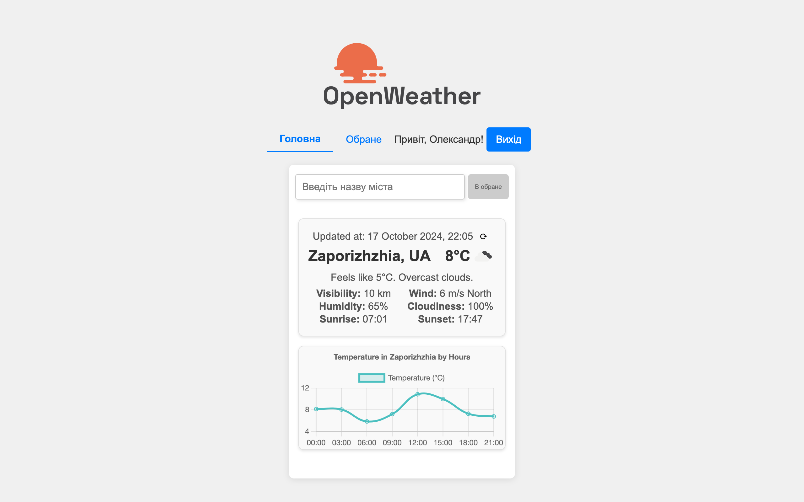
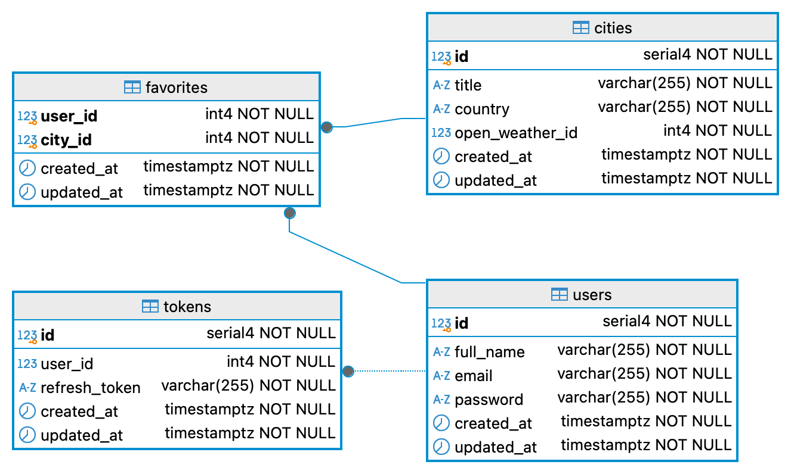

<p align="center">
  

<p align="center">
  

## Опис Додатку Weather

Додаток Weather — це веб-додаток для отримання інформації про погоду в реальному часі. Основна мета цього додатку полягає в наданні користувачам можливості легко отримувати актуальні погодні дані для різних міст, здійснювати пошук за містами та зберігати улюблені місця для швидкого доступу.

## ↓ Скріншот Додатку ↓

<details>
  <summary><strong>Натисніть тут, щоб розгорнути</strong></summary>



</details>

### Основна Функціональність Додатку:

<details>
  <summary><strong>Натисніть тут, щоб розгорнути</strong></summary>

1. **Реєстрація та Авторизація**: Користувачі можуть зареєструватися та увійти до системи, використовуючи свої облікові дані (логін/пароль). Всі роутери, що потребують авторизації, є приватними.

2. **Автокомпліт для Міст**: Додаток включає функціональність автокомпліта, яка дозволяє користувачам швидко знаходити потрібні міста для отримання прогнозу погоди.

3. **Відображення Погоди**: Інформація про погоду відображається у вигляді картки, яка містить дані про погоду на поточний день.

4. **Графік Температури**: Додаток реалізує графік температури на поточний день, використовуючи бібліотеки для візуалізації (Chart.js).

5. ~~**Блоки Погоди**: Користувачі можуть створити до п'яти блоків погоди для різних міст, із можливістю додавати нові блоки через кнопку “+”.~~

6. ~~**Видалення Блоків**: Користувачі можуть видаляти блоки погоди з підтвердженням через модальне вікно.~~

7. **Вкладка "Обране"**: Користувачі можуть додавати та видаляти улюблені міста. Обрані міста зберігаються у базі даних, а максимальна кількість улюблених міст обмежена п'ятьма.

8. **Адаптивний Дизайн**: Додаток має адаптивний дизайн, що забезпечує комфортне використання на різних пристроях.

9. ~~**Перемикання Відображення**: Додаток надає можливість перемикання між відображенням погодних умов "День/Ніч", а також "День/На 5 днів".~~

10. **Прелоадери**: Включені прелоадери для візуалізації процесу завантаження даних з API.

</details>

## Схема бази даних

<p align="center">
  

## Використані технології та біблиотеки

<details>
  <summary><strong>Натисніть тут, щоб розгорнути</strong></summary>

### Серверні технології:

- **Node.js** – середовище виконання JavaScript на сервері.
- **Express** – веб-фреймворк для створення серверних застосунків. Забезпечує маршрутизацію та обробку запитів.
- **Sequelize** – ORM (Object-Relational Mapping) для роботи з базою даних PostgreSQL. Дозволяє взаємодіяти з базою даних через моделі, а також керувати міграціями та сидуванням даних.
- **PostgreSQL** – реляційна база даних, що використовується для зберігання даних застосунку.
- **bcrypt** – бібліотека для хешування паролів, що використовується для підвищення безпеки даних користувачів.
- **jsonwebtoken** – бібліотека для роботи з JWT (JSON Web Token), яка використовується для авторизації та створення токенів доступу.
- **cookie-parser** – middleware для обробки файлів cookie в Express.
- **cors** – middleware для керування політикою доступу між доменами (CORS).
- **dotenv** – бібліотека для завантаження змінних оточення з `.env` файлу.
- **pg** і **pg-hstore** – бібліотеки для взаємодії з PostgreSQL з використанням Sequelize.
- **http-errors** – бібліотека для створення HTTP помилок у застосунку Express.
- **yup** – бібліотека для валідації даних на сервері.

### Клієнтські технології:

- **React** – бібліотека для побудови інтерфейсів користувача. Використовується для створення компонентів і управління станом.
- **Axios** – бібліотека для виконання HTTP-запитів. Використовується для комунікації з сервером і API.
- **Chart.js** – бібліотека для створення графіків і діаграм. Використовується для відображення погодних даних у вигляді графіків.
- **React-Chartjs-2** – обгортка для інтеграції Chart.js з React.
- **react-router-dom** – бібліотека для роботи з маршрутизацією в React. Використовується для організації навігації між сторінками.
- **date-fns** – бібліотека для роботи з датами, яка використовується для форматування і обробки часу.
- **Vite** – інструмент для збірки проєктів, що забезпечує швидку розробку та збірку клієнтської частини.

### DevDependencies:

- **ESLint** – інструмент для аналізу коду, що допомагає дотримуватися кращих практик програмування.
- **Nodemon** – утиліта, що дозволяє автоматично перезапускати сервер при внесенні змін у код.
- **Morgan** – middleware для ведення логів HTTP-запитів в Express.
- **Sequelize CLI** – інструмент для керування міграціями та сидуванням даних у Sequelize.

</details>

## Системні вимоги

- **Git**: 2.46 або вище
- **NodeJS**: v18.20 або вище
- **NPM**: 10.8 або вище
- **PostgreSQL**: 16.3 або вище

## Підготовка та інсталяція проєкту перед запуском

1. Клонувати репозиторій:

```bash
git clone git@github.com:sytnikovzp/weather.git
```

2. Перейти до каталогу проекту:

```bash
cd weather
```

3. Перейти до каталогу серверної частини:

```bash
cd server
```

4. Встановити залежності:

```bash
npm i
```

5. Повернутись до каталогу проєкту:

```bash
cd ..
```

6. Перейти до каталогу клієнтської частини:

```bash
cd client
```

7. Встановити залежності:

```bash
npm i
```

8. Повернутись до каталогу проєкту:

```bash
cd ..
```

## Конфігураційні змінні в '/.env'

Створіть в кореневому каталогу проєкту файл конфігурації `.env`

```yaml
#For client
VITE_PORT=3000
WEATHER_API_KEY = '0a7384eacf0bf030169dafe3d90513f6'

#For server
WEATHER_SERVER_HOST=localhost
WEATHER_SERVER_PORT=5000

ACCESS_SECRET=access_secret
REFRESH_SECRET=refresh_secret
ACCESS_TOKEN_TIME=15m
REFRESH_TOKEN_TIME=60d

SALT_ROUNDS=9
CLIENT_URL=http://localhost:3000

#For database
DB_USER=postgres
DB_PASS=root
DB_NAME=weatherdb
DB_DIALECT=postgres
```

<details>
  <summary><strong>Або запустіть ЦЕЙ скрипт в кореневому каталогу проєкту, натисніть щоб розгорнути</strong></summary>

```bash
cat <<EOL > /.env
#For client
VITE_PORT=3000
WEATHER_API_KEY = '0a7384eacf0bf030169dafe3d90513f6'

#For server
WEATHER_SERVER_HOST=localhost
WEATHER_SERVER_PORT=5000

ACCESS_SECRET=access_secret
REFRESH_SECRET=refresh_secret
ACCESS_TOKEN_TIME=15m
REFRESH_TOKEN_TIME=60d

SALT_ROUNDS=9
CLIENT_URL=http://localhost:3000

#For database
DB_USER=postgres
DB_PASS=root
DB_NAME=weatherdb
DB_DIALECT=postgres
EOL
```

</details>

## Ініціалізація бази даних

1. Перейдіть до каталогу server:

```bash
cd server
```

2. Та виконайте запуск скрипту, який створить базу даних, виконає запуск міграцій та наповнення бази даних (seeders):

```bash
npm run dbinit
```

## Запуск проєкту

### Запуск серверної частини:

1. З кореневого каталогу проєкту перейдіть до каталогу server:

```bash
cd server
```

2. Та виконайте запуск скрипту, який запустить сервер:

```bash
npm start
```

### Запуск клієнтської частини:

1. З кореневого каталогу проєкту перейдіть до каталогу client:

```bash
cd client
```

2. Та виконайте запуск скрипту, який запустить клієнську частину:

```bash
npm start
```

## Щоб завершити роботу клієнта або сервера, натисніть відповідно:

```bash
CTRL + C
```

# Документація API

### Контролер Аутентифікації

<details>
  <summary><strong>Натисніть тут, щоб розгорнути</strong></summary>

Усі запити повинні бути виконані до авторизованого користувача, за виключенням реєстрації та логіну.
Токен має передаватися у заголовку Authorization у форматі Bearer Token.

#### 1. Реєстрація користувача

**Метод**: POST
**URL**: `/api/auth/register`
**Опис**: Створює нового користувача.
**Тіло запиту**:

<pre><code>{
  "fullName": "Ім'я користувача",
  "email": "email користувача",
  "password": "пароль"
}
</code></pre>

**Відповідь**:

<pre><code>{
  "accessToken": "JWT access токен",
  "refreshToken": "JWT refresh токен",
  "user": {
    "id": 1,
    "fullName": "Ім'я користувача",
    "email": "email користувача"
  }
}
</code></pre>

#### 2. Логін користувача

**Метод**: POST
**URL**: `/api/auth/login`
**Опис**: Логін користувача, видає JWT токени.
**Тіло запиту**:

<pre><code>{
  "email": "email користувача",
  "password": "пароль"
}
</code></pre>

**Відповідь**:

<pre><code>{
  "accessToken": "JWT access токен",
  "refreshToken": "JWT refresh токен",
  "user": {
    "id": 1,
    "fullName": "Ім'я користувача",
    "email": "email користувача"
  }
}
</code></pre>

#### 3. Логаут користувача

**Метод**: POST
**URL**: `/api/auth/logout`
**Опис**: Видаляє refresh токен і завершує сесію користувача.
**Тіло запиту**: не потрібне.

**Відповідь**: 200 OK

#### 4. Оновлення токенів (Refresh)

**Метод**: POST
**URL**: `/api/auth/refresh`
**Опис**: Оновлює JWT токени, використовуючи refresh токен з cookies.
**Тіло запиту**: не потрібне.

**Відповідь**:

<pre><code>{
  "accessToken": "JWT access токен",
  "refreshToken": "JWT refresh токен"
}
</code></pre>

#### 5. Отримання списку всіх користувачів

**Метод**: GET
**URL**: `/api/auth/users`
**Опис**: Повертає список усіх зареєстрованих користувачів.
**Тіло запиту**: не потрібне.

**Відповідь**:

<pre><code>[
  {
    "id": 1,
    "fullName": "Ім'я користувача",
    "email": "email користувача"
  },
  ...
]</code></pre>

#### 6. Отримання профілю поточного користувача

**Метод**: GET
**URL**: `/api/auth/profile`
**Опис**: Повертає інформацію про поточного авторизованого користувача.
**Тіло запиту**: не потрібне.

**Відповідь**:

<pre><code>{
  "id": 1,
  "fullName": "Ім'я користувача",
  "email": "email користувача"
}
</code></pre>

#### 7. Отримання користувача за ID

**Метод**: GET
**URL**: `/api/auth/users/:id`
**Опис**: Повертає інформацію про користувача за його ID.

**Відповідь**:

<pre><code>{
  "id": 1,
  "fullName": "Ім'я користувача",
  "email": "email користувача"
}
</code></pre>

#### 8. Оновлення даних користувача

**Метод**: PUT
**URL**: `/api/auth/users`
**Опис**: Оновлює дані користувача.
**Тіло запиту**:

<pre><code>{
  "id": 1,
  "fullName": "Нове ім'я користувача",
  "email": "новий email користувача",
  "password": "новий пароль"
}
</code></pre>

**Відповідь**:

<pre><code>{
  "id": 1,
  "fullName": "Нове ім'я користувача",
  "email": "новий email користувача"
}
</code></pre>

#### 9. Видалення користувача

**Метод**: DELETE
**URL**: `/api/auth/users/:id`
**Опис**: Видаляє користувача за його ID.

**Відповідь**: 200 OK

</details>

### Контролер Обраних Міст

<details>
  <summary><strong>Натисніть тут, щоб розгорнути</strong></summary>
  
Цей контролер відповідає за керування обраними містами користувача.

#### 1. Отримання списку обраних міст користувача

**Метод**: GET
**URL**: `/api/favorites`
**Опис**: Повертає список обраних міст поточного авторизованого користувача для відображення погоди.

**Відповідь**:

<pre><code>
[
  {
    "id": 1,
    "cityName": "Назва міста",
    "country": "Країна",
    "openWeatherId": "ID з OpenWeather"
  },
  ...
]</code></pre>

#### 2. Додавання міста до обраних

**Метод**: POST
**URL**: `/api/favorites`
**Опис**: Додає місто до обраного списку користувача.

**Тіло запиту**:

<pre><code>
{
  "openWeatherId": "ID з OpenWeather",
  "cityName": "Назва міста",
  "country": "Країна"
}</code></pre>

**Відповідь**:

<pre><code>
{
  "id": 1,
  "cityName": "Назва міста",
  "country": "Країна",
  "openWeatherId": "ID з OpenWeather",
  "email": "email користувача"
}</code></pre>

#### 3. Видалення міста з обраного

**Метод**: DELETE
**URL**: `/api/favorites/:openWeatherId`
**Опис**: Видаляє місто з обраного списку користувача за його OpenWeather ID.

**Відповідь**:

**Статус**: 200 OK

</details>
